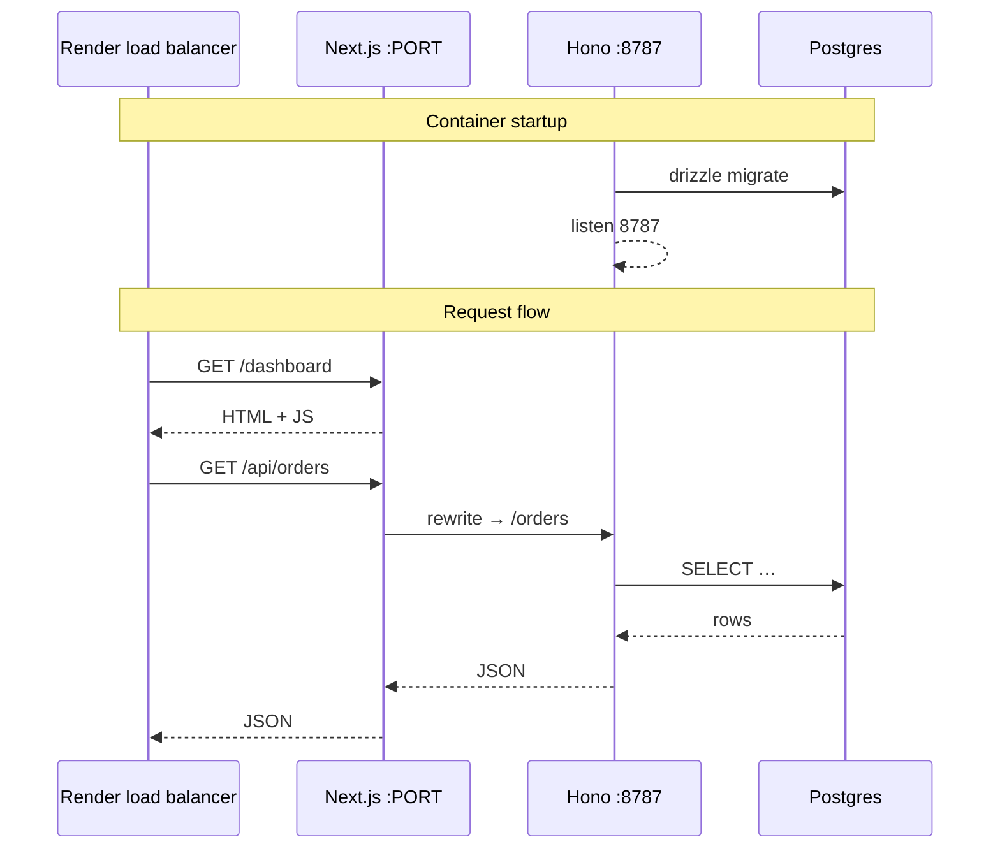
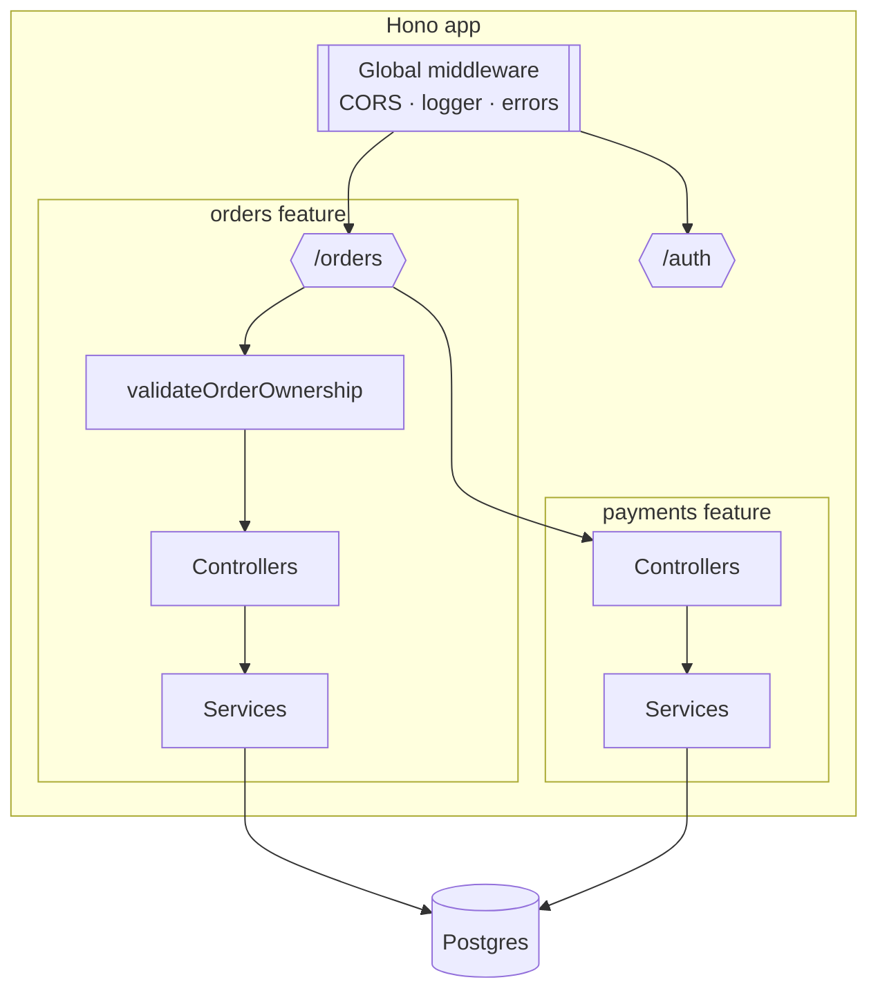
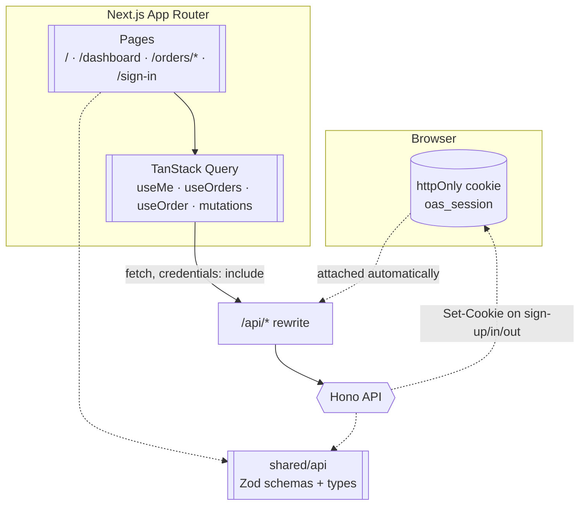
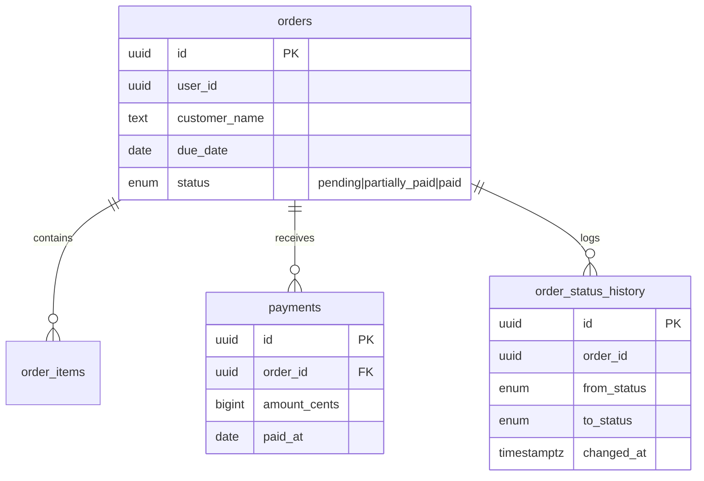
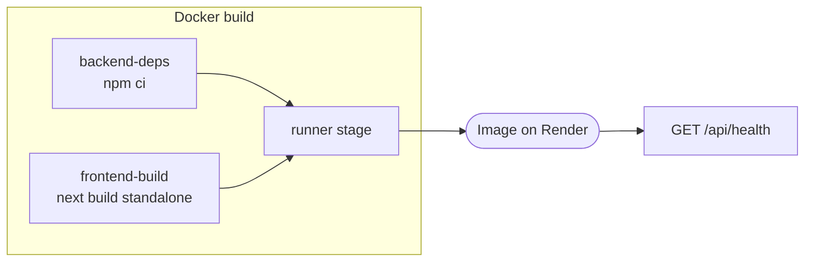

# Architecture

Orders & Settlements is a full-stack order ledger: operators create orders with line items, record payments, and see derived settlement status. This document describes how the pieces fit together in local development and production.

## Stack

| Layer | Technology | Role |
| ----- | ---------- | ---- |
| Frontend | Next.js 16 (App Router), React, TanStack Query | Dashboard, auth UI, client-side session |
| API | Hono (TypeScript) | REST endpoints, auth middleware, business logic |
| Database | Supabase Postgres | Orders, line items, payments, audit tables |
| Auth | Supabase Auth (email + password) | Sign-up / sign-in; JWT validated on API |
| ORM / migrations | Drizzle | Schema, queries, migrations on startup (prod) |
| Shared contracts | `shared/api/` (Zod + types) | Request validation and API shapes used by both tiers |
| Hosting | Render (Docker) | Single container: Next.js + Hono + migrate |

## System context

```mermaid
flowchart TB
  subgraph users [Users]
    browser([Browser])
  end

  subgraph render [Render — Docker container]
    direction TB
    next[["Next.js<br/>App Router + React Query"]]
    hono{{"Hono API<br/>feature routes"}}
    next -->|"rewrite /api/*"| hono
  end

  subgraph supabase [Supabase]
    auth([("Supabase Auth")])
    db[(("Postgres<br/>orders · payments · audit"))]
  end

  browser -->|"HTTPS · pages + /api/*"| next
  hono -->|"SQL via Drizzle"| db
  hono -->|"sign-up / sign-in / token verify"| auth
```

The browser never talks to Hono or Supabase directly in production. All API calls — including sign-up and sign-in — go to `/api/...` on the same origin; Next.js rewrites those requests to the in-container Hono process, which is the only thing that talks to Supabase.

## Production runtime

One Docker image runs three startup steps in [`docker-entrypoint.sh`](docker-entrypoint.sh):

1. **Migrate** — `npm run db:migrate` (Drizzle)
2. **API** — Hono on internal port `8787` (`tsx` + `NODE_PATH` for shared schemas)
3. **Web** — Next.js standalone on Render’s public `PORT`



| Process | Port | Visibility |
| ------- | ---- | ------------ |
| Next.js | `$PORT` (Render-injected) | Public |
| Hono | `8787` | Internal only |
| Postgres | Supabase pooler | External managed |

Environment: `BACKEND_URL=http://127.0.0.1:8787` is baked at **build** time for Next rewrites; runtime secrets (`DATABASE_URL`, `SUPABASE_*`, `CORS_ORIGIN`) come from Render.

## Local development

Two processes, same contract as production:

```mermaid
flowchart LR
  devBrowser([Browser :3000])
  devNext[["Next.js dev"]]
  devHono{{"Hono dev :8787"}}
  devDb[(("Postgres"))]

  devBrowser --> devNext
  devNext -->|"/api/* rewrite"| devHono
  devHono --> devDb
```

```bash
# Terminal 1
cd backend && npm run dev    # :8787

# Terminal 2
npm run dev                  # :3000, BACKEND_URL defaults to localhost:8787
```

## Backend structure

Feature-based layout per [`AGENTS.md`](AGENTS.md): routes → controllers → services → Drizzle. Reusable middleware lives under `backend/global/`.



| Feature | Endpoints (prefix `/orders` or `/auth`) | Notes |
| ------- | --------------------------------------- | ----- |
| Auth | `POST /auth/sign-up`, `sign-in`, `sign-out`, `GET /auth/me` | Supabase JWT in an httpOnly cookie → `userId`/`userEmail` on context |
| Orders | CRUD, list, export CSV, status history | Scoped by `userId` |
| Payments | `POST/GET …/:id/payments` | Row lock, idempotency key, overpayment guard |

## Frontend structure



The session token never reaches page JavaScript — it lives only in an httpOnly cookie the browser attaches to every `/api/*` request. The frontend asks `GET /auth/me` (via `useMe`) to know whether it's signed in rather than reading a token itself. Protected pages use `useRequireSession` (redirects to `/sign-in` when `useMe` comes back empty); the landing page uses `useHasSession` for conditional CTAs only. See [README.md § Auth & sessions](README.md#auth--sessions) for the cookie's exact attributes and the CSRF tradeoff.

## Data model and status



**Status rules:**

- **Stored** on `orders.status`: `pending`, `partially_paid`, `paid` (updated when payments are recorded).
- **Derived at read time**: `overdue` when due date is past and balance remains — never written to the DB.
- **Audit**: DB triggers append to `order_status_history` on create and payment-driven status changes; `overdue` does not appear there.

Payment recording uses a transaction with `SELECT … FOR UPDATE` on the order row to serialize concurrent payments.

## Shared API contract

[`shared/api/`](shared/api/) holds Zod schemas and TypeScript types imported by:

- Backend controllers (validation via `throwValidationError`)
- Frontend forms and React Query clients

This keeps validation messages and field shapes identical across tiers without duplicating logic.

## Deployment artifact



See [`Dockerfile`](Dockerfile), [`render.yaml`](render.yaml), and [`README.md`](README.md) for env vars and deploy steps.
